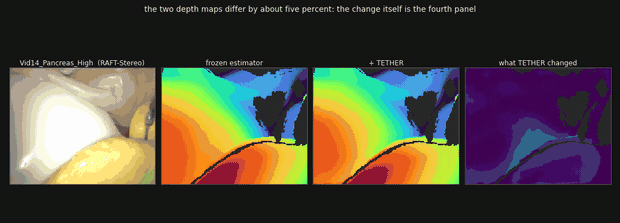
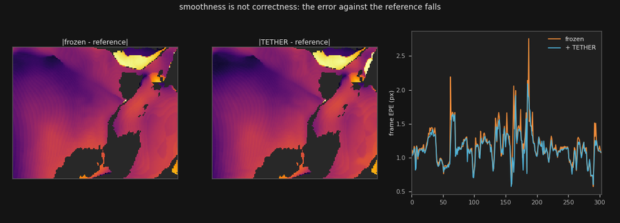
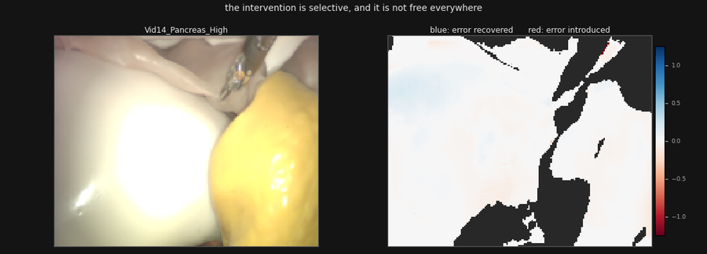

<div align="center">

# TETHER

**Tethered Causal Temporal Refinement for Frozen Surgical Stereo**

*One causal temporal module, trained once, attached unchanged to frozen and heterogeneous stereo estimators.*



<sub>RAFT-Stereo on DRENDS, zero-shot. Left to right: the scene, the frozen estimator's disparity,
the refined disparity, and the change the module applied. The two disparity maps differ by about
five percent — the fourth panel is that difference, which is the honest way to show it.</sub>

</div>

---

## What this is

Modern stereo estimators are applied independently to each frame. Nothing in a frame-wise model
requires its predictions to cohere over time, and video-stereo methods fix that by building
temporal reasoning *into* the estimator — so a new backbone means a new temporal model.

TETHER asks the opposite question: **can one causal temporal module be trained once and attached,
unchanged, to frozen and heterogeneous stereo estimators?**

It reads only what a black box emits — the preceding disparity, motion-aligned with frozen
SEA-RAFT, and a shared 38-channel evidence space of disparity, motion and image geometry. No cost
volume, no hidden state, no confidence head, no backbone internals, no future frame. A
**154,874-parameter** reset-and-fusion head emits one scalar per pixel, and the output is a bounded
interpolation between the current estimate and the aligned memory.

## Results

One frozen checkpoint, trained on three estimators and one dataset.

| | |
|---|---|
| **Held-out (SCARED-C D7)** | mean EPE `0.4921 → 0.4651` pooled, **−5.49%**; all five estimators improve |
| **Zero-shot (DRENDS)** | disparity EPE, Bad3 and metric depth MAE/RMSE improve in **all 25** recording×backbone cells: `−5.41`, `−19.51`, `−4.02`, `−3.47%` |
| **Unseen estimators** | two of the five are excluded from temporal-head training, and we cannot separate them from the seen three |
| **Seed invariance** | all **15/15** backbone×arena cells improve at all three pre-registered seeds, on EPE and on Bad1 |
| **Not smoothing** | under a matched state machine, **3.69%** mean EPE against **0.59%** for the best fixed or EMA blend |
| **Accumulated into a map** | world-frame disagreement falls **11.7%** held out, in all 20 cells |
| **Cost** | `28.90 ms` overhead, `95.2 MB` peak VRAM (H100); ~16 ms deploying without the reverse flow pass |

## What we could not claim

This is the part the project is actually built around, and it is not decoration.

- **The map result reverses on development.** Refinement *increases* world-frame disagreement by
  15.5% on D2, in all 15 cells. We withdrew the per-cell explanation: raw excess orders the 35
  cells at `ρ=+0.72` only because the two splits' ranges never overlap, and inside them it orders
  nothing (`−0.47` on D2, `+0.11` on D7).
- **No-reference temporal consistency is gameable.** A degenerate replay of warped history removes
  97.3% of that score. It is why the robotics claim is measured after accumulation instead.
- **The fusion weight is not an uncertainty.** It ranks harm at AUROC 0.59–0.61 on the split the
  checkpoint was selected on, and at chance held out.
- **A per-backbone specialist is not beaten, only matched.** Given a matched gradient budget, three
  times the selection points and validation on its own backbone, a specialist moves held-out
  bad-pixel rate by at most 0.04 absolute percentage points either way, and loses mean EPE on four
  of five. Generality is free here; it is not free by a margin.
- **The convex action space lost its cross-backbone claim** to its own pre-registered falsification
  clause, and the claim appears nowhere in the paper.

<div align="center">

<br/>
<sub><b>Smoothness is not correctness.</b> Absolute error against the reference, and the running
per-frame EPE. The frozen estimator (orange) spikes above the refined stream (blue) at every
failure — which is the claim, rather than that the picture wobbles less.</sub>
<br/><br/>

<br/>
<sub><b>The intervention is selective, and it is not free everywhere.</b> Blue is error recovered,
red is error introduced. The red is not cropped.</sub>
</div>

## Protocol

Evaluation scores the *intervention*, not the prediction. Support is fixed and
prediction-independent, invalid predictions on valid support are penalised rather than silently
dropped, and introduced error is reported beside recovered error. Every headline is
pre-registered: the endpoint, the threshold below which a difference is not read, and the
falsification clauses that retire a claim when they fire.

## Repository

| path | what |
|---|---|
| `ARGOS_hand/paper/` | the ICRA submission, its figures and the video attachment pipeline |
| `ARGOS_hand/original_h4/model_design/` | the head, the training entry points and the pre-registrations |
| `ARGOS_hand/original_h4/scripts/` | evaluation, ablation, seed and analysis entry points |
| `ARGOS_hand/results/` | finished evaluation records |
| `docs/ARGOS_WOUND.md` | the wider ARGOS-Wound workspace this sits inside |

The video attachment is regenerated rather than committed — `*.mp4` is ignored on purpose:

```bash
python ARGOS_hand/original_h4/scripts/dump_drends_frames.py --backbone RAFT-Stereo
python ARGOS_hand/original_h4/scripts/render_drends_video.py
```

## Status

Under review at ICRA 2027. An extended version with per-sequence tables, the full policy grid and
the protocols accompanies the code, checkpoint and curation release.
